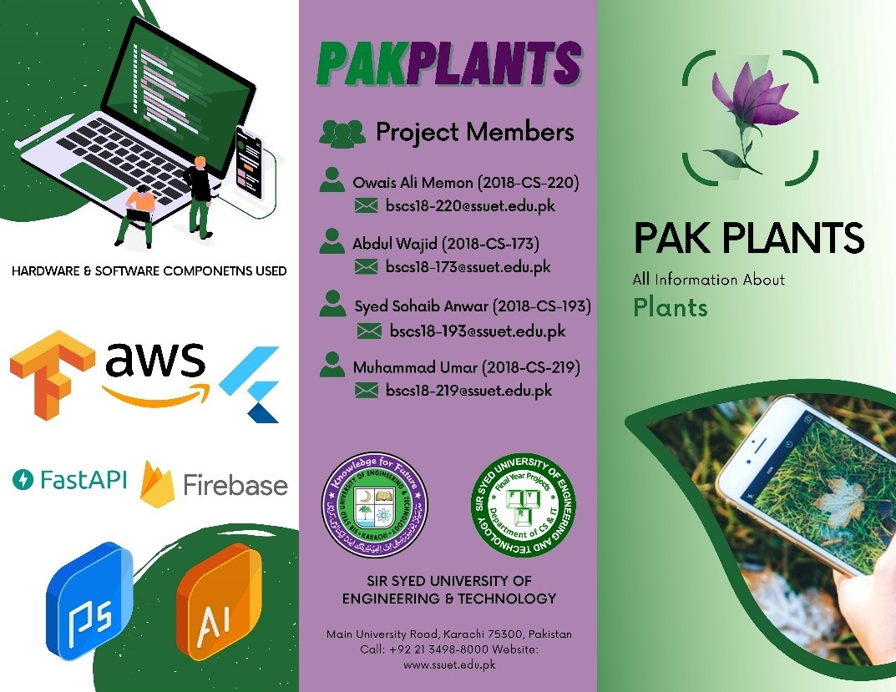
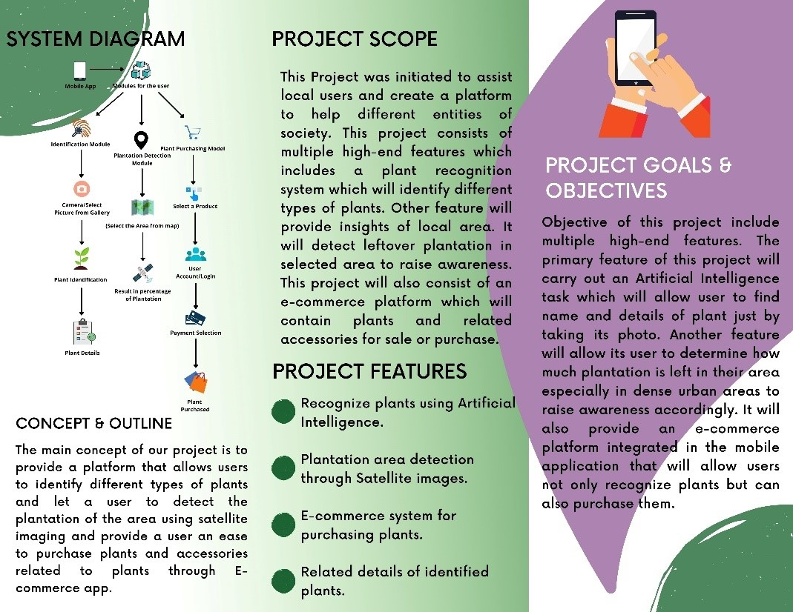
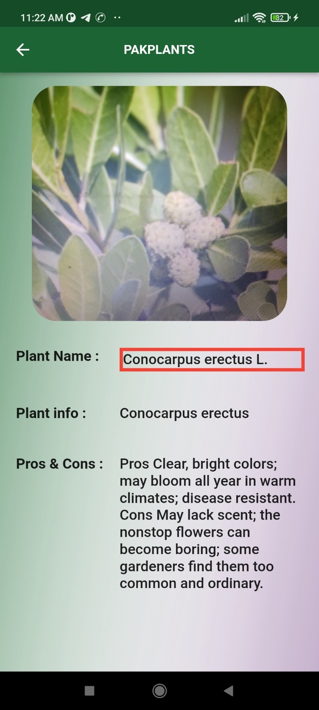
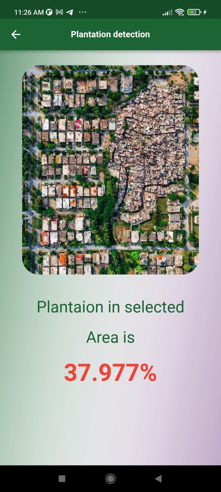

# Final Year Project: PAKPLANTS

**This repository contain all the frontend of project PAKPLANTS**

**PAKPLANTS  is a mobile application that allow user to to identify plants only using images of their respective leaves by uploading or capturing at real time**
**It also allow user to identify plantation area left in an satellite images uploaded by user. Finally, offer an e-commerce store integrated inside the application.**

PAKPLANTS is based on deep learning and image processing techonology!






## Built With

- Flutter
- tenserflow
- Keras
- AWS
- FASTAPI
- OpenCV


## Live Demo

[Live Demo Link]()




## Back-end Link

[Back-end Link](https://github.com/AbdulWajid99/PAKPLANTS_Webapp)


## Setup

If you installed git you can clone the code to your machine, or download a ZIP of all the files directly.

Run the following [git](https://git-scm.com/downloads) command to clone the files to your machine:

```bash
git clone https://github.com/owaisalimemon/pakplants_fyp
```

- Once the files are on your machine, open the _html-css-javascript-getting-started_ folder in [Visual Studio Code](https://code.visualstudio.com/)


## Authors


👤 **Author1** GitHub: [@githubhandle](https://github.com/AbdulWajid99))

👤 **Author2** GitHub: [@githubhandle](https://github.com/walikhan226))

👤 **Author3** GitHub: [@githubhandle](https://github.com/Sohaib1497))

👤 **Author4** GitHub: [@githubhandle](https://github.com/owaisalimemon))


## 🤝 Contributing

Contributions, issues, and feature requests are welcome!

Feel free to check the [issues page](../../issues/).

## Show your support

Give a ⭐️ if you like this project!


## 📝 License

This project is [MIT](LICENSE.txt) licensed.

